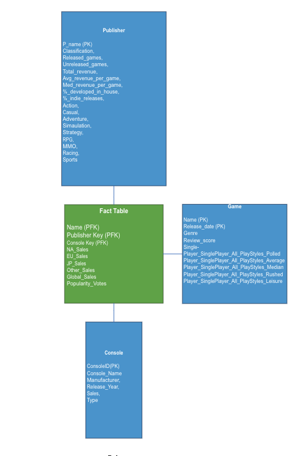

## Project Description:
### Grain: The popularity and sales of a game made by a specific publisher for a specific console.
## Conceptual model:

## Dimensions and dimensional attributes:
### **Publisher Dimension:**
Publishers database is a list of all the video game publishers on Steam.
| Name                 | Type     | Description                                        |
|----------------------|----------|----------------------------------------------------|
| Name(PK)             | str      | Publisher Name                                     |
| Classification       | Category | Game Classification (e.g. AAA, Indie ...)          |
| Released_games       | int      | Number of Released Games                           |
| Unreleased_Games     | int      | Number of unreleased Games                         |
| Total_revenue        | float    | Total Revenue                                      |
| Avg_revenue_per_game | float    | The average game revenue                           |
| Med_revenue_per_game | float    | The Median of Game Revenue Distribution            |
| %_developed_in_house | float    | Percentage of games developed in house             |
| %_indie_releases     | float    | Percentage of releases form third-party Developers |
| Action               | float    | Percentage of releases of the Action genre         |
| Casual               | float    | Percentage of releases of the Casual genre         |
| Adventure            | float    | Percentage of releases of the Adventure genre      |
| Simulation           | float    | Percentage of releases of the Simulation genre     |
| Strategy             | float    | Percentage of releases of the Strategy genre       |
| RPG                  | float    | Percentage of releases of the RPG genre            |
| MMO                  | float    | Percentage of releases of the MMO genre            |
| Racing               | float    | Percentage of releases of the Racing genre         |
| Sports               | float    | Percentage of releases of the Sports genre         |
### **Game Dimension:**
Game dimension is a list of all the video games.
| Name                               | Type     | Description                                                                                                                    |
|------------------------------------|----------|--------------------------------------------------------------------------------------------------------------------------------|
| Name(PK)                           | str      | Game Name                                                                                                                      |
| Release_date                       | str      | Release date of the game. Format: YYYY-MM-DD, Sample value = 1993-01-24                                                        |
| Genre                              | str      | Genre of the game. One of the following 9 values: Action, Adventure, Comedy, Crime, Family, Fantasy, Mystery, Sci-Fi, Thriller.|
| Review_score                       | int      | Number of unreleased Games                                                                                                     |
| SinglePlayer_All_PlayStyles_Polled | float    | Total number of surveys polled.                                                                                                |
| SinglePlayer_All_PlayStyles_Average| float    | The average playtime for a game based on all the polls (in seconds)                                                            |
| SinglePlayer_All_PlayStyles_Median | float    | The Median playtime for a game based on all the polls (in seconds)                                                             |
| SinglePlayer_All_PlayStyles_Rushed | float    | The average Rushed playtime for a game based on all the polls (in seconds)                                                     |
| SinglePlayer_All_PlayStyles_Leisure| float    | The average Leisure playtime for a game based on all the polls (in seconds)                                                    |

### **Console dimension**
Console dimension is a list of all the video game consoles.
| Name                 | Type     | Description                                              |
|----------------------|----------|----------------------------------------------------------|
| ConosleId(PK)        | str      | Abbreviated Console Name.                                |
| Console Name         | str      | Console Name.                                            |
| Manufacturer         | str      | Name of the console manufacturer.                        |
| Release_year         | int      | Year in which the console was released.                  |
| Sales                | float    | Sales amount for a specific console                      |
| Type                 | float    | The type of console, could be handheld or Home type.     |

### **Fact table:**

| Name                               | Type     | Description                                            |
|------------------------------------|----------|--------------------------------------------------------|
| Game Key(PFK)                      | str      | Game Key from game dimension.                          |
| Publisher Key(PFK)                 | str      | Publisher key from publisher dimension                 |
| Console Key (PFK)                  | str      | Console key from console dimension.                    |
| NA_Sales                           | float    | Measure of sales in North America.                     |
| EU_Sales                           | float    | Measure of sales in Europe.                            |
| JP_Sales                           | float    | Measure of sales in Japan.                             |
| Other_Sales                        | float    | Measure of sales in other countries.                   |
| Global_Sales                       | float    | Measure of global sales.                               |
| Popularity_Votes                   | float    | Measure of popularity votes for a specific game,       |

## Assumptions:

- As a game consulting firm, analyze data from the gaming industry to help your client in
identifying the most bankable game genre, style, gaming platform.
- We assume that we have access to a subset of raw data for the gaming industry.
- Our datasets are taking a subset of what the actual game votes and sales might be,
however the proportion indicates how popular or not a game is based on this subset.
- Our current set of data lists/classifies multiple such games, consoles and publishers that
have been discontinued. For now, we assume that all the listed classes are relevant to our
model. However, we plan to prune our dataset to make it more relevant to today’s market.
- We assume that attributes related to game playtime are an average of the time that players
take to finish a particular game in main story mode or story mode with extras.
Essentially, we intend to use the metric as a standard time required to finish a game.
- We will be using our source datasets to create datasets as per our dimensional models.
- We assume that the sample used to get the review scores and measure the playtime of a
game is representative of all its player base.

## Issues and Challenges:

