# Queries

## Slice
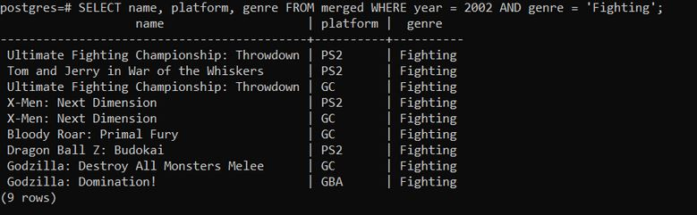
## Dice
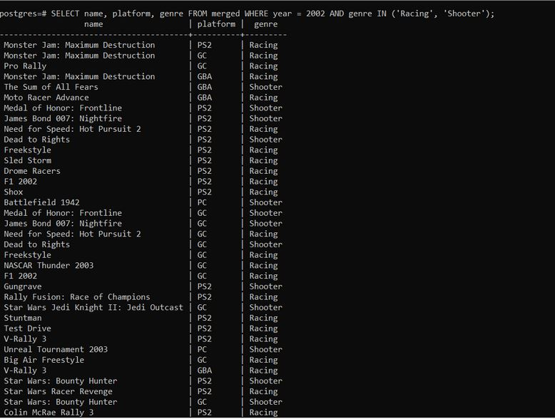
## OLAP combination
- This SQL statement uses the WHERE clause to filter for the "Action" genre and the 2010 and 2011 years. It then uses the GROUP BY clause to group the data by year and genre, and the SUM function to calculate the total global sales for each group. The result set will contain the global sales data for the "Action" genre during 2010 and 2011.
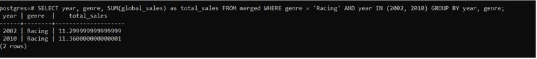
## Drill Down
- This query drills down from the year dimension to the platform dimension, and calculates the total sales of video games in North America by year and by platform for the years 2010-2012.
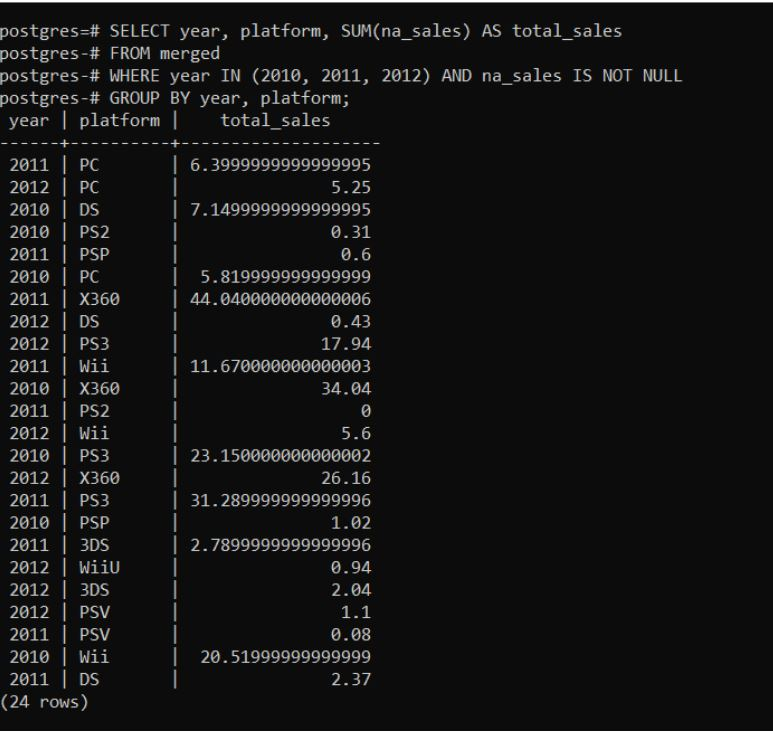
## Roll Up
- This query uses the GROUP BY clause to group the data by the year and genre columns, and the SUM function is used to calculate the total sales for each combination of year and genre. The GROUPING SETS clause is used to specify multiple grouping sets, which represent different levels of the hierarchy. The resulting output includes the total sales for each year and genre combination, the total sales for each year, and the total sales for all data points. This is an example of a roll-up operation, which allows for easy aggregation of data at different levels of granularity.
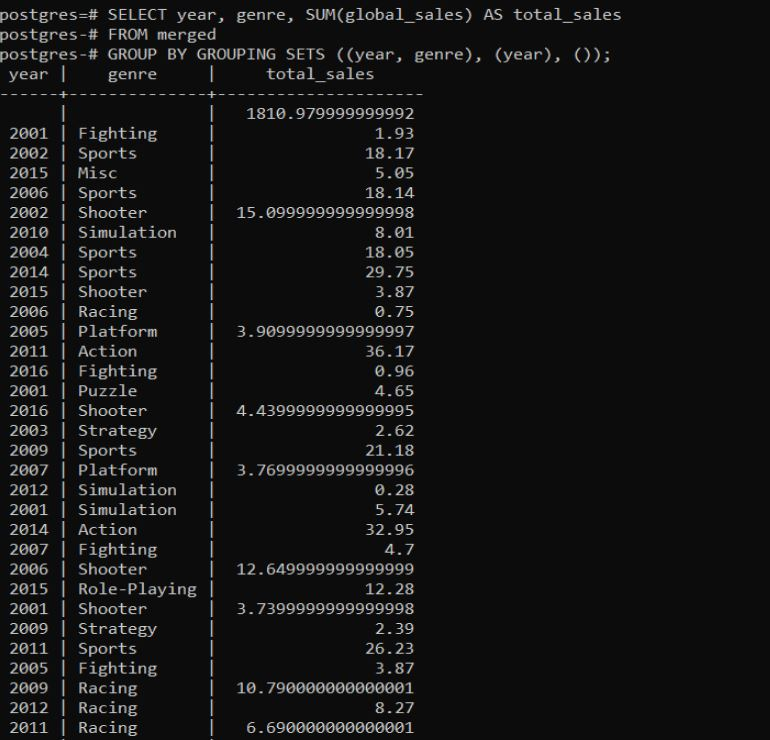
## Iceberg query
- This SQL query groups the video games by their release year, calculates the total global sales for each year using the SUM function, and then filters the results to only include years whose total sales are greater than or equal to 10% of the total global sales for all years. Finally, the results are sorted in descending order of total sales.
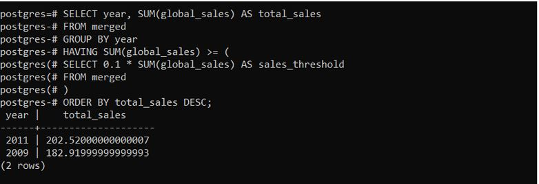
## Windowing query
- This query uses the RANK window function to rank the video games based on their global sales within each year and platform combination. The PARTITION BY clause is used to define the partitioning of the data, which in this case is based on the year and platform columns. The ORDER BY clause specifies the order of the data within each partition, which is based on the global sales in descending order. The WHERE clause filters the results to only include video games released in or after 2017. Finally, the results are sorted in ascending order of year, platform, and sales rank.
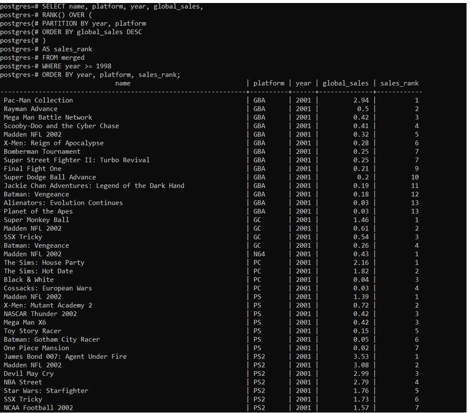
## Windowing clause
- Here is an example of a windowing query using the WINDOW clause that calculates the moving average of global sales for each video game title over a window of 3 years.
This query uses the AVG window function to calculate the moving average of global sales for each video game title over a window of 3 years. The PARTITION BY clause is used to define the partitioning of the data, which in this case is based on the name column. The ORDER BY clause specifies the order of the data within each partition, which is based on the year column. The ROWS BETWEEN clause defines the window frame, which includes the current row, the previous row, and the following row. Finally, the results are sorted in ascending order of name and year.

# Vizualisation

## Slice

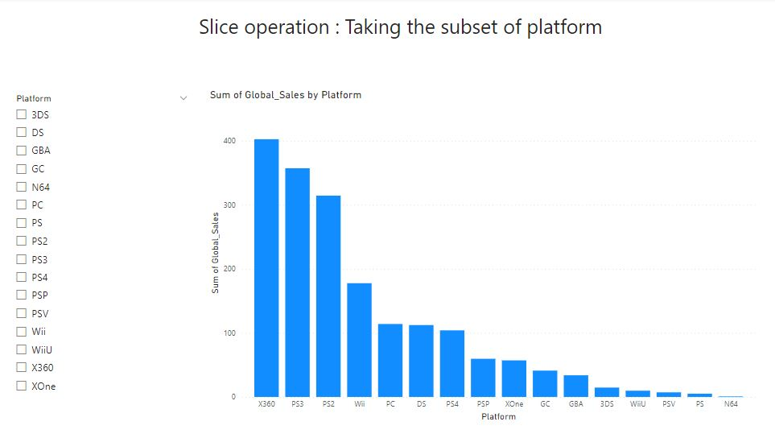

## Dice

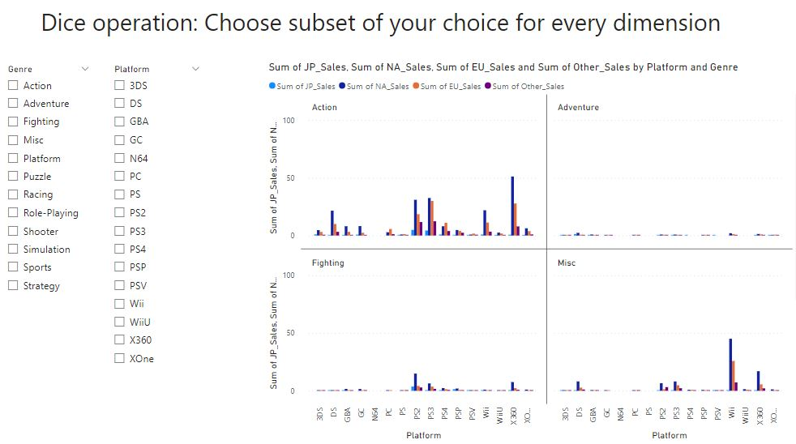

## topN

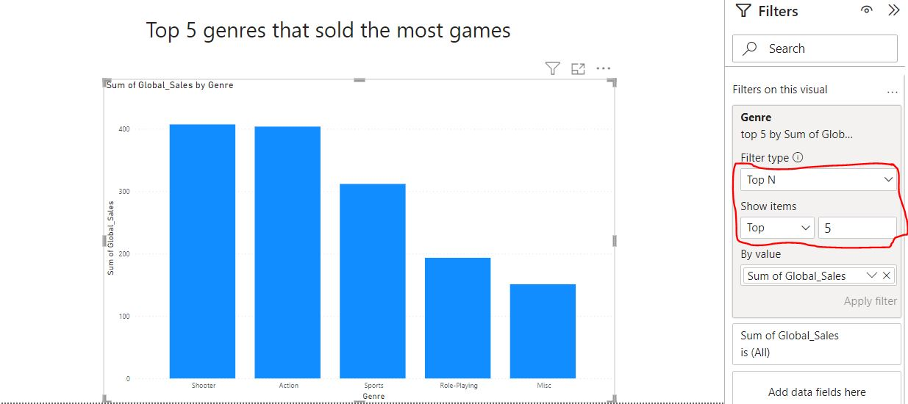

## bottomN

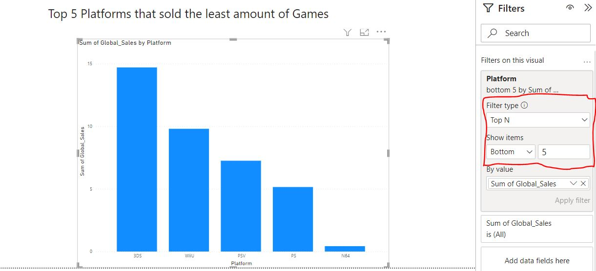

## Roll Up

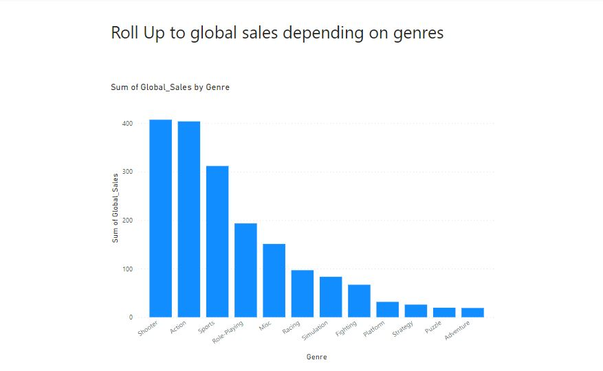

## Drill Down

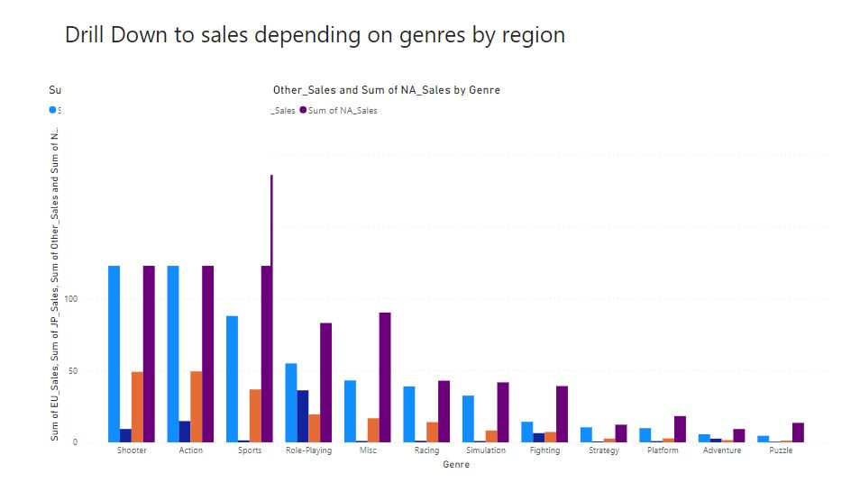

PowerBI link:
[PowerBi file - PowerBi file](https://github.com/maanuw/Fundamentals-of-Data-Science/tree/main/OLAP-Vizualisation-Data-Mining-Deliverable-3/video_games.pbix)
