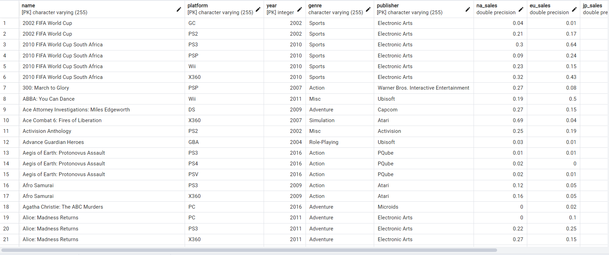
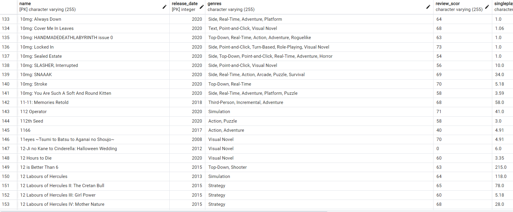
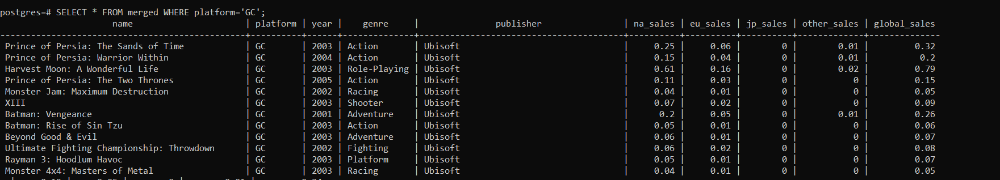
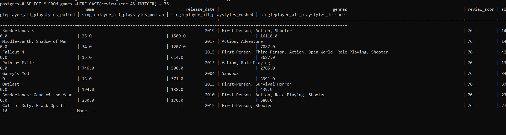

## Implementation
- We sourced our data as shown in the References section.
- As per our conceptual design we have three main dimensions that we performed ETL implementation for `Game`, `Console` and `Publisher`
- Our Working and explaination for the Extraction and transformation for the dimensions is available here:
- [Publisher Dimention](https://github.com/maanuw/Fundamentals-of-Data-Science/blob/main/Physical-Design-Deliverable-2/transformation/Publisher.ipynb)
- [Game Dimension](https://github.com/maanuw/Fundamentals-of-Data-Science/blob/main/Physical-Design-Deliverable-2/transformation/game.ipynb)
- [Console Dimension](https://github.com/maanuw/Fundamentals-of-Data-Science/blob/main/Physical-Design-Deliverable-2/transformation/Console.ipynb)
- [Fact Table](https://github.com/maanuw/Fundamentals-of-Data-Science/blob/main/Physical-Design-Deliverable-2/transformation/Merge_to_FTable.ipynb)

## Challenges
- The domain chosen by our team surprisingly has very scarcely available open source data.
- Our team had to source data from multiple sources in order for us to be able to converge these data points into our data mart.
- Our sourced data required alot of preprocessing.
- We had to find methods to deal with missing data as explained in the Game Dimension notebook.
- Missing values, if it was a primary key then we could try to delete it but if it was an integer we would find other ways to fill it.
An example can be, if the value of sales is missing then maybe we can try either using the mean value to fill it or using a AI model to fill it.
- Duplicated primary key, in this example we would usually try to find more attributes to add to the primary key in order to create the composite key.
But if for example we have multiple primary keys and we still have duplicates (release_date, name) then we would try to look at the data and find the fake one.

## Dimensions and Fact table on DBMS
- DBMS used postgres and pgadmin

## Fact Table Image in database

## Game Dimension

## Test Queries

